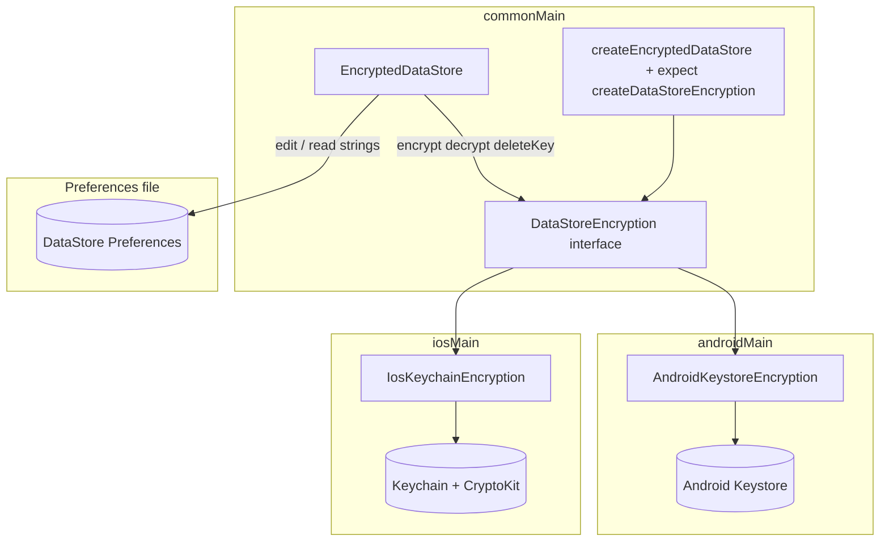

# EncryptedDataStore — TicketTribe / BrainX

This document describes how encrypted preferences work in the **`shared:localDatastore`** Kotlin Multiplatform module and how TicketTribe wires them through **`shared:core:datasource`**.

## What this module provides

| Type | Package | Role |
|------|---------|------|
| `EncryptedDataStore` | `com.brainx.local_datastore.encryption` | Wraps `DataStore<Preferences>`; values are JSON-serialized, then AES-256-GCM encrypted, then Base64 in preferences. |
| `createEncryptedDataStore` | same | Factory used by Koin; requires a non-null datastore name from `DatastoreFileProvider`. |
| `DatastoreFileProvider` | `com.brainx.local_datastore.provider` | Supplies the logical DataStore name (file stem) used in encryption key identifiers. |
| `datastoreModuleProvider` | `com.brainx.local_datastore.di` | Koin module: `DataStore<Preferences>` + `EncryptedDataStore`. |

**Dependencies (see `shared/localDatastore/build.gradle.kts`):** AndroidX DataStore Preferences (api), Koin, `kotlinx-serialization-json`, and **kotlin-cryptography** (`cryptography-core`, `cryptography-provider-base`; iOS adds `cryptography-provider-cryptokit`).

---

## TicketTribe wiring

1. **`datastoreModuleProvider`** is merged in `com.brainx.datasource.di.ModuleProvider` as `datastoreModulesProvider` (alongside Room, Ktor, etc.).
2. **`DatastoreFileProvider`** is bound in `com.brainx.datasource.di.AppConfigModule` to **`DatastoreFileProviderImp`**, which reads the name from **`AppConfig.Datastore.DATA_STORE_FILE_NAME`** (`shared/core/datasource/src/commonMain/kotlin/com/brainx/datasource/AppConfig.kt`).
3. **Current datastore name:** `"ticket_tribe.preferences_pb"`. This string is the `datastoreName` segment in every encryption key identifier (see below).
4. **`DatastorePrefManager`** (`DatastorePrefManagerImp` in `shared/core/datasource`) injects **`EncryptedDataStore`** and uses:
    - **`encryptedDataStore`** for **`access_token`** and **`refresh_token`** (encrypted).
    - **`encryptedDataStore.innerDataStore`** for **`is_login`** and **`is_first_time_installed`** (plain booleans in the same `Preferences` file).

No second DataStore instance is created for encryption; both paths share the same `DataStore<Preferences>` instance from `datastoreModuleProvider`.

---

## On-disk layout (Preferences)

Logical keys you pass to `EncryptedDataStore` (e.g. `"access_token"`) are stored as:

| Internal preference key | Content |
|-------------------------|---------|
| `__enc_value_<key>` | Base64-encoded ciphertext (platform AES-GCM payload; see below). |
| `__enc_meta_<key>__` | Marker string `"1"` (reserved for future use). |

Implementation: `EncryptedDataStore` in `EncryptedDataStore.kt` (`VALUE_PREFIX`, `META_PREFIX`, `META_SUFFIX`).

---

## Encryption pipeline

**Write**

1. Serialize value with **kotlinx.serialization** → JSON UTF-8 bytes (default `Json { ignoreUnknownKeys = true }` via `EncryptedDataStoreDefaults.json`).
2. Encrypt with **`DataStoreEncryption.encrypt(keyId, bytes)`** → raw ciphertext bytes (format depends on platform).
3. **Base64** (`kotlin.io.encoding.Base64`) → store in `__enc_value_*`.

**Read**

1. Read Base64 → decode → **`DataStoreEncryption.decrypt(keyId, ciphertext)`** → plaintext bytes → JSON string → deserialize.
2. On any failure (missing key, bad Base64, decrypt error, JSON error), **`get` / `getFlow` return `defaultValue`** (exceptions are not thrown from `get`).

**Key identifier (`keyId`)**

Built in `EncryptedDataStore.keyIdentifier`:

```text
{keyPrefix}.{datastoreName}.{preferenceKey}
```

- **Default `keyPrefix`:** `"com.brainx.local_datastore"` (`createEncryptedDataStore` in `EncryptedDataStoreFactory.kt`).
- **`datastoreName`:** from `DatastoreFileProvider.getDatastoreName()` — in this app, **`ticket_tribe.preferences_pb`**.

**Example** for preference key `access_token`:

```text
com.brainx.local_datastore.ticket_tribe.preferences_pb.access_token
```

That string is the Android Keystore **alias** and the iOS Keychain **account** (`kSecAttrAccount`) for the AES key material.

---

## How encryption is implemented (guide for new developers)

This section explains the **architecture and algorithms** so you can maintain this module or **rebuild the same pattern** in another project.

### 1. Layered design



**Responsibility split**

| Layer | Responsibility |
|-------|----------------|
| **`EncryptedDataStore`** (common) | JSON serialize/deserialize, Base64 encode/decode, map logical keys → preference keys (`__enc_value_*`), build stable **`keyId`** strings, call `DataStoreEncryption` for raw bytes only. |
| **`DataStoreEncryption`** (expect/actual) | Per-`keyId` AES-256-GCM: derive or load a secret, encrypt plaintext bytes → **self-contained** ciphertext bytes (includes IV/nonce + tag in the blob), decrypt the reverse, remove key material on `deleteKey`. |
| **DataStore file** | Stores only **strings**: Base64(ciphertext bytes). No keys in the file. |

**Invariant:** Whatever `encrypt` returns must be everything `decrypt` needs besides the stable `keyId` (which locates the key in Keystore/Keychain). Do not store the IV in a separate preference; it lives inside the binary blob.

---

### 2. `DataStoreEncryption` contract (`DataStoreEncryption.kt`)

Implement this internal interface on each platform:

| Method | Semantics |
|--------|-----------|
| `encrypt(identifier, data: ByteArray): ByteArray` | `identifier` is the **`keyId`** (`prefix.datastoreName.preferenceKey`). Return **opaque** ciphertext bytes (must include random nonce/IV and auth tag for GCM). |
| `decrypt(identifier, data: ByteArray): ByteArray` | Same `identifier`; `data` is exactly what `encrypt` produced. Return original plaintext bytes. |
| `deleteKey(identifier)` | Remove the platform secret for that `identifier` so future decrypt fails until a new key is created. |

**Threading:** In this codebase the interface is **synchronous**. The iOS implementation uses **`runBlocking`** around kotlin-cryptography’s suspend CryptoKit calls—acceptable here because encrypt/decrypt are quick; if you reimplement, either keep calls fast or move to a suspend API at the `EncryptedDataStore` layer.

---

### 3. `EncryptedDataStore` logic (reimplement checklist)

If you copy the pattern without this repo’s sources, implement in **commonMain**:

1. **Stable `keyId`** — `listOf(keyPrefix, datastoreName, logicalKey).joinToString(".")` (or any stable scheme; changing it breaks existing ciphertext).
2. **Preference key mapping** — e.g. `stringPreferencesKey("__enc_value_" + logicalKey)` and optional meta key.
3. **`put`** — `json.encodeToString` → `plaintext UTF-8 bytes` → `encryption.encrypt(keyId, bytes)` → `Base64.encode` → `dataStore.edit { ... }`.
4. **`get` / `getFlow`** — read string → Base64 decode → `encryption.decrypt` → UTF-8 string → `json.decodeFromString`; on any exception return **default**.
5. **`delete`** — remove preference entries, then `encryption.deleteKey(keyId)`.

Use **`kotlinx.serialization`** for types; for `String`, the JSON is a quoted string.

---

### 4. Android implementation recipe (`AndroidKeystoreEncryption.kt`)

**Goal:** Keys never leave **AndroidKeyStore**; app only holds `SecretKey` handles.

1. **Open keystore:** `KeyStore.getInstance("AndroidKeyStore").load(null)`.
2. **Create key if missing:** `KeyGenerator.getInstance(KeyProperties.KEY_ALGORITHM_AES, "AndroidKeyStore")` with `KeyGenParameterSpec.Builder(identifier, PURPOSE_ENCRYPT \| PURPOSE_DECRYPT)` — use **`identifier` as the Keystore alias** — `.setBlockModes(GCM)`, `.setEncryptionPaddings(NONE)`, `.setKeySize(256)`, then `generateKey()`.
3. **Encrypt:** `Cipher.getInstance("AES/GCM/NoPadding")`, `init(ENCRYPT_MODE, secretKey)`, read **`cipher.iv`** (12 bytes), `ciphertext = cipher.doFinal(plaintext)`, return **`iv + ciphertext`** (tag is appended by `doFinal` inside `ciphertext`).
4. **Decrypt:** Split `data` into **first 12 bytes = IV**, remainder = ciphertext+tag, `GCMParameterSpec(128, iv)`, `init(DECRYPT_MODE, key, spec)`, `doFinal(ciphertextPortion)`.
5. **Delete:** `keyStore.deleteEntry(identifier)`; optionally clear an in-memory cache of `SecretKey` for that alias.
6. **Edge cases:** Handle **`KeyPermanentlyInvalidatedException`** (e.g. delete + retry encrypt); **`InvalidKeyException`** when device locked → map to a clear `IllegalStateException` message.

---

### 5. iOS implementation recipe (`IosKeychainEncryption.kt`)

**Goal:** A **32-byte AES-256 key** per `keyId` is stored in **Keychain**; GCM is done in process (key bytes are in app memory when used—unavoidable for software AES unless you use Secure Enclave–only APIs differently).

1. **Key storage:** Generic password item: `kSecClassGenericPassword`, **`kSecAttrAccount` = full `keyId`**, **`kSecAttrService`** = your app constant (here `com.brainx.local_datastore`), **`kSecAttrAccessibleAfterFirstUnlockThisDeviceOnly`**, value = **32 random bytes** (`Random.nextBytes`).
2. **Lookup:** `SecItemCopyMatching` with return data + limit one; handle `errSecItemNotFound` for decrypt vs create paths.
3. **Encrypt/decrypt:** Decode key bytes as **AES-256-GCM** (this project uses **kotlin-cryptography** `CryptographyProvider.CryptoKit` + `AES.GCM`: decode RAW key, `cipher.encrypt(plaintext)` / `cipher.decrypt(ciphertext)`). The library’s output format is the blob stored (after Base64) in DataStore—**do not mix** Android’s manual `IV || ct` with a different layout unless you use the same codec on both platforms (this app uses **per-platform** blobs; tokens are not shared across OS in one file, so that is fine).
4. **Write key to Keychain:** Build `NSData` from bytes, `SecItemAdd` with `kSecValueData`; delete-then-add if updating.
5. **Delete:** `SecItemDelete` query matching service + account.

**Interop note:** Android ciphertext and iOS ciphertext formats **do not need to match** as long as each platform’s `encrypt`/`decrypt` pairs are consistent. The same **logical** DataStore file is not migrated between Android and iOS devices as raw files in normal app use.

---

### 6. Factory wiring (`EncryptedDataStoreFactory.kt` + `DataStoreEncryptionFactory.kt`)

1. **`expect fun createDataStoreEncryption(keyPrefix, datastoreName): DataStoreEncryption`** in common.
2. **`actual`** in `androidMain` / `iosMain` returns your platform implementation (constructors may ignore `keyPrefix`/`datastoreName` if `keyId` is already fully formed in `EncryptedDataStore`—this project passes them for consistency; Android uses only the combined `keyId` from the wrapper).
3. **`createEncryptedDataStore(dataStore, datastoreFileProvider, keyPrefix)`** — resolve **non-null** `datastoreName`, call `createDataStoreEncryption`, construct `EncryptedDataStore(dataStore, encryption, keyPrefix, datastoreName)`.

---

### 7. Dependencies to add (if starting fresh)

| Area | Typical artifacts |
|------|-------------------|
| Preferences | `androidx.datastore:datastore-preferences` |
| JSON | `kotlinx-serialization-json` + Kotlin serialization plugin |
| Crypto (optional shared API) | `dev.whyoleg.cryptography:cryptography-core`, `cryptography-provider-base`, and on iOS **`cryptography-provider-cryptokit`** |
| DI | Koin (or manual singleton) |

You can skip kotlin-cryptography on Android and use **`javax.crypto`** only, as this module does on Android today.

---

### 8. Files in this repository (reference map)

Paths are under `shared/localDatastore/`.

| Path | Role |
|------|------|
| `src/commonMain/kotlin/com/brainx/local_datastore/encryption/DataStoreEncryption.kt` | Interface + KDoc contract |
| `src/commonMain/kotlin/com/brainx/local_datastore/encryption/EncryptedDataStore.kt` | Wrapper + Base64 + JSON |
| `src/commonMain/kotlin/com/brainx/local_datastore/encryption/EncryptedDataStoreFactory.kt` | Public factory |
| `src/commonMain/kotlin/com/brainx/local_datastore/encryption/DataStoreEncryptionFactory.kt` | `expect` declaration |
| `src/androidMain/kotlin/com/brainx/local_datastore/encryption/AndroidKeystoreEncryption.kt` | Android `actual` + Keystore |
| `src/iosMain/kotlin/com/brainx/local_datastore/encryption/IosKeychainEncryption.kt` | iOS `actual` + Keychain + CryptoKit |
| `src/androidMain/kotlin/com/brainx/local_datastore/di/DataStorePlatformModule.android.kt` | Koin (Android) |
| `src/iosMain/kotlin/com/brainx/local_datastore/di/DataStorePlatformModule.ios.kt` | Koin (iOS) |
| `src/commonMain/kotlin/com/brainx/local_datastore/di/DataStorePlatformModule.kt` | `expect` / `datastoreModuleProvider` |

---

## Platform implementations

### Android — `AndroidKeystoreEncryption`

- **Keystore:** `"AndroidKeyStore"`.
- **Cipher:** `AES/GCM/NoPadding`, 256-bit key, GCM tag length **128** bits.
- **Stored blob layout:** **12-byte IV** concatenated with ciphertext+tag from `Cipher.doFinal` (IV is **not** in a separate preference; it is the first 12 bytes of the decrypted binary before Base64).
- **Key alias:** the full `keyId` string above.
- **Lock / biometrics:** `InvalidKeyException` with message *"EncryptedDataStore: Cannot access Keystore - device may be locked."*
- **Key invalidation:** `KeyPermanentlyInvalidatedException` triggers delete + retry on encrypt; decrypt may still throw after invalidation.

### iOS — `IosKeychainEncryption`

- **AES-GCM** via **CryptoKit** through kotlin-cryptography (`CryptographyProvider.CryptoKit`, `AES.GCM`).
- **Key material:** 32 random bytes per `keyId`, stored as Keychain **generic password**:
    - **`kSecClassGenericPassword`**
    - **`kSecAttrService`:** fixed `"com.brainx.local_datastore"` (constructor default; factory does not override).
    - **`kSecAttrAccount`:** the full `keyId` string (same as Android alias).
    - **`kSecAttrAccessible`:** `kSecAttrAccessibleAfterFirstUnlockThisDeviceOnly`
- **Errors:** *"Cannot access Keychain - device is locked."* (`errSecInteractionNotAllowed`), *"No encryption key found"* when decrypting without a stored key.

---

## Koin usage in this repo

**Include the module** (already done in `ModuleProvider.kt`):

```kotlin
import com.brainx.local_datastore.di.datastoreModuleProvider

// merged into datastoreModulesProvider
```

**Requirements:**

- A **`DatastoreFileProvider`** binding with **`getDatastoreName()` non-null** (TicketTribe: `DatastoreFileProviderImp` + `AppConfig`).
- Do not call **`createEncryptedDataStore`** with a provider that returns `null` for the name — the factory throws **`IllegalArgumentException`**.

**Inject** `EncryptedDataStore` anywhere in KMP common/Android/iOS code that has access to the `shared:localDatastore` API.

---

## API summary (`EncryptedDataStore`)

| API | Notes |
|-----|--------|
| `suspend fun <T> get(key, defaultValue, serializer)` | Decrypt + deserialize; failures → `defaultValue`. |
| `suspend inline fun <reified T> get(key, defaultValue)` | Uses generated serializer. |
| `suspend fun <T> put(key, value, serializer)` | Serialize + encrypt + edit preferences. |
| `suspend inline fun <reified T> put(key, value)` | |
| `fun <T> getFlow(key, defaultValue, serializer)` | `distinctUntilChanged()` on decrypted values. |
| `inline fun <reified T> getFlow(key, defaultValue)` | |
| `suspend fun delete(key)` | Removes `__enc_*` entries and calls `encryption.deleteKey(keyId)`. |
| `innerDataStore` | Same underlying `DataStore<Preferences>` for **unencrypted** keys. |

Constructor is **`internal`**; use **`createEncryptedDataStore`** or Koin-provided singleton.

---

## Security and operations notes

1. **Tokens vs flags:** Treat OAuth tokens as encrypted (`EncryptedDataStore`); non-sensitive flags can stay on `innerDataStore` like `DatastorePrefManagerImp`.
2. **Uninstall:** Keystore / Keychain entries are removed with the app; ciphertext left in backups without keys is useless.
3. **iOS backup:** `AfterFirstUnlockThisDeviceOnly` avoids iCloud Keychain-style sync of these items.
4. **Tampering:** GCM authentication fails decrypt; callers see **`defaultValue`** for `get` / `getFlow`, not a thrown error.
5. **Migration from older storage:** If you previously stored tokens with a different mechanism (e.g. a custom cipher), **old values are not automatically migrated** to `EncryptedDataStore`. Users may need to sign in again once.

---

## Troubleshooting

| Symptom | Likely cause |
|---------|----------------|
| `defaultValue` / `null` for tokens | First launch after change, corrupt data, wrong key, or decrypt failure (see pipeline above). |
| *No encryption key found* | Key deleted, new install, or identifier mismatch vs. stored Keychain/Keystore entry. |
| *Cannot access Keystore / Keychain — locked* | Device locked before first unlock (iOS) or Keystore unusable while locked (Android). |
| Build / runtime issues on iOS | Ensure `cryptography-provider-cryptokit` is on `iosMain` and Foundation interop matches your Kotlin/Native version. |

---

## Manual construction (non-Koin)

```kotlin
import com.brainx.local_datastore.encryption.createEncryptedDataStore

val encrypted = createEncryptedDataStore(
    dataStore = myDataStore,
    datastoreFileProvider = myProvider, // getDatastoreName() must be non-null, e.g. "ticket_tribe.preferences_pb"
    keyPrefix = "com.brainx.local_datastore" // optional; this is the default
)
```
